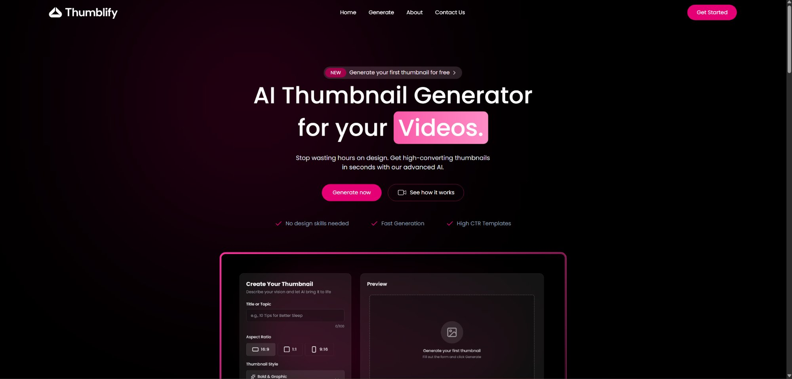
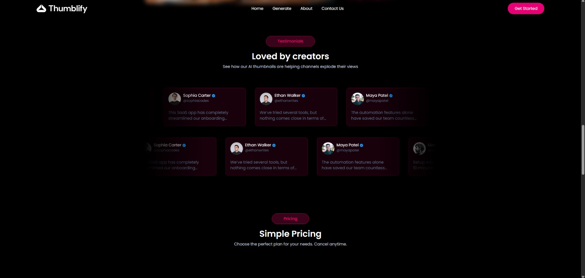
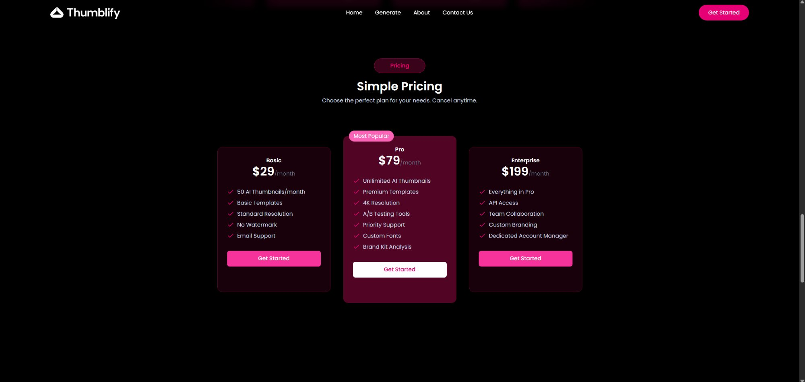
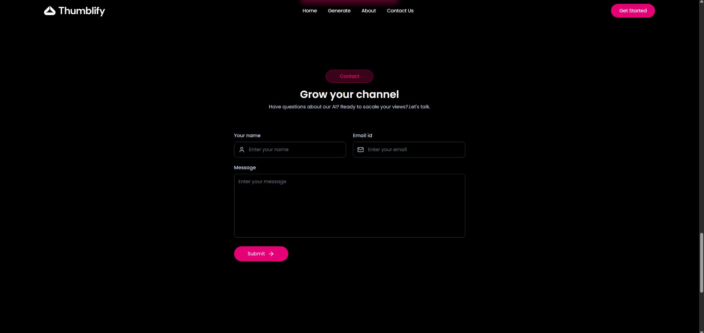
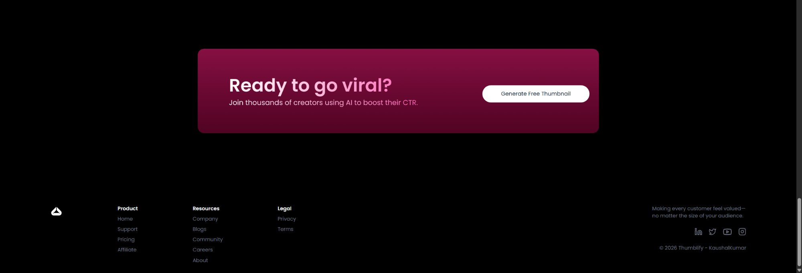
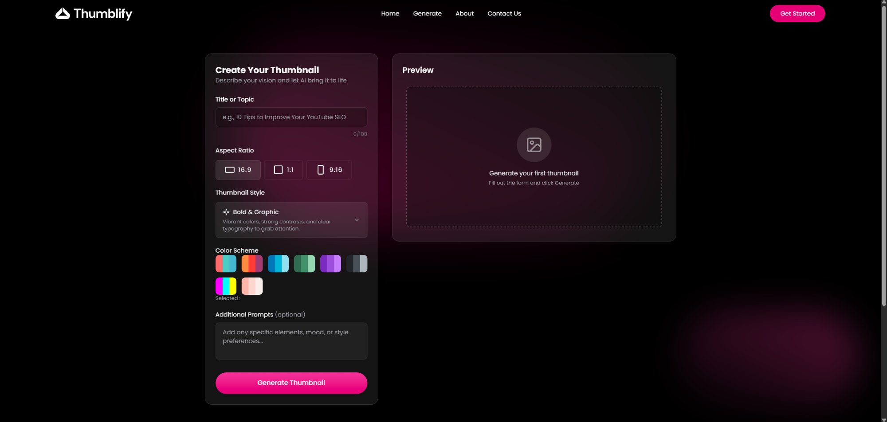
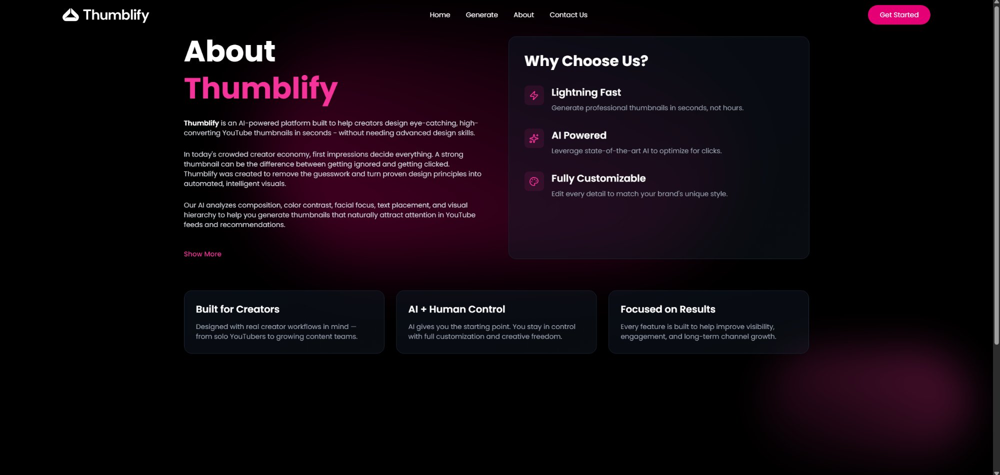
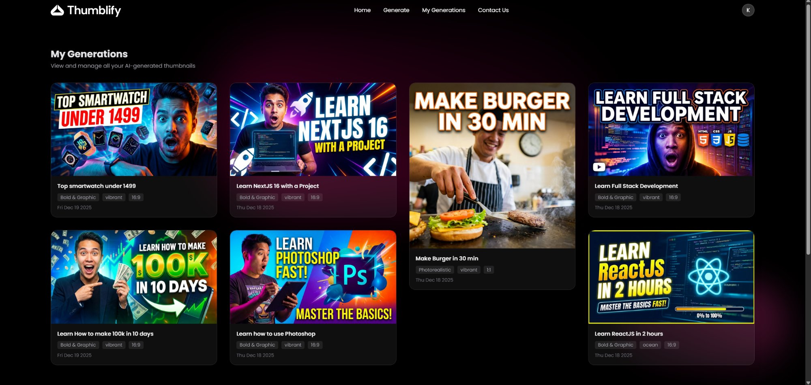
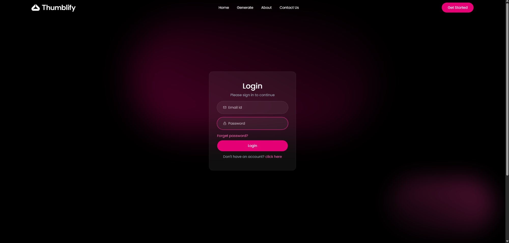
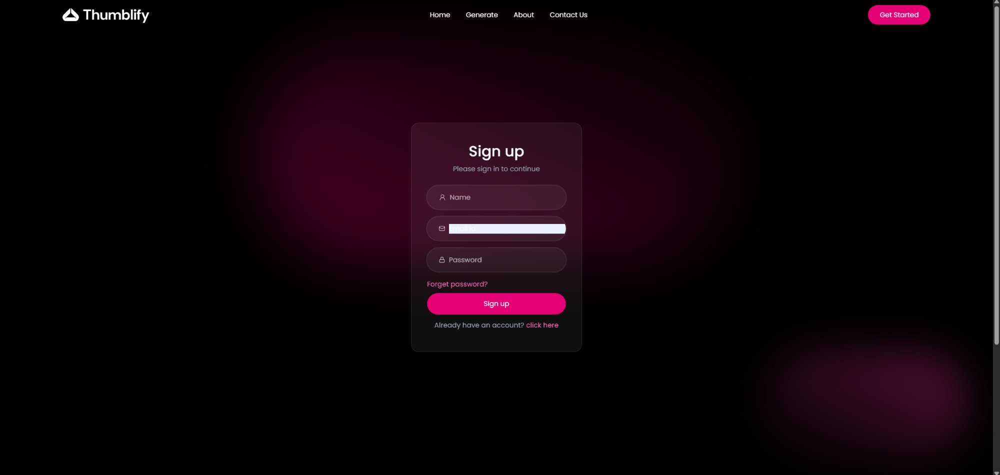

# Thumblify - AI Thumbnail Generator

<div align="center">
  <h3>🎨 Create Stunning YouTube Thumbnails with AI in Seconds</h3>
  
  
  
  
  
  
  
  
</div>

---

## 📋 Table of Contents

- [Overview](#-overview)
- [Features](#-features)
- [Technology Stack](#-technology-stack)
- [Screenshots](#-screenshots)
- [Project Structure](#-project-structure)
- [Getting Started](#-getting-started)
  - [Prerequisites](#prerequisites)
  - [Backend Setup](#backend-setup)
  - [Frontend Setup](#frontend-setup)
- [API Documentation](#-api-documentation)
- [Current Status](#-current-status)
- [Roadmap](#-roadmap)
- [Contributing](#-contributing)
- [License](#-license)

---

## 🎯 Overview

Thumblify is a full-stack web application that revolutionizes YouTube thumbnail creation through AI-powered generation. Built with modern technologies, it provides content creators with an intuitive platform to design eye-catching, high-converting thumbnails in seconds without requiring advanced design skills.

### ⚠️ Current Status

**AI Generation Notice:** The Google Gemini API integration is currently unavailable. The application uses mock data to demonstrate the complete UI workflow and user experience. All authentication, navigation, and interface features remain fully operational.

---

## ✨ Features

### 🎨 Frontend Features

- **Intuitive Thumbnail Creator** - User-friendly interface with real-time preview
- **Full Authentication System** - Complete login and registration flows
- **Responsive Design** - Optimized for desktop, tablet, and mobile devices
- **Gallery Management** - View and manage generated thumbnails
- **Customization Options**
  - Multiple aspect ratios (16:9, 1:1, 9:16)
  - Various thumbnail styles (Bold & Graphic, Minimalist, Photorealistic, etc.)
  - Custom color schemes and palettes
  - Additional prompt customization
- **Fast Performance** - Vite-powered development and build process
- **Type Safety** - TypeScript for robust code quality

### 🚀 Backend Features

- **AI-Powered Generation** - Google Gemini API integration for intelligent thumbnail creation
- **User Authentication** - Complete user registration and login system
- **Cloud Storage** - Cloudinary integration for reliable image hosting and delivery
- **Thumbnail Management** - Full CRUD operations for thumbnail assets
- **MongoDB Database** - Robust data persistence with Mongoose ODM
- **RESTful API** - Clean, well-documented API endpoints
- **Type-Safe Backend** - TypeScript for improved reliability

---

## 🛠️ Technology Stack

### Frontend

| Technology | Purpose |
|------------|---------|
| **React.js** | UI component library |
| **TypeScript** | Type-safe JavaScript |
| **Vite** | Fast build tool and dev server |
| **React Router** | Client-side routing |
| **React Context API** | Global state management |
| **CSS** | Styling with utility-first approach |

### Backend

| Technology | Purpose |
|------------|---------|
| **Node.js** | JavaScript runtime environment |
| **Express.js** | Web application framework |
| **TypeScript** | Type-safe development |
| **MongoDB** | NoSQL database |
| **Mongoose** | MongoDB object modeling |
| **Google Gemini API** | AI thumbnail generation |
| **Cloudinary** | Cloud image storage and delivery |

---

## 📸 Screenshots

### Landing Page - Hero Section

*AI-powered thumbnail generation with customizable options*

### Features Section

*Smart analysis, eye-catching designs, and fully editable templates*

### Testimonials

*User testimonials from content creators*

### Pricing Plans

*Flexible pricing options for all creator levels*

### Contact Section

*Easy way to get in touch and grow your channel*

### Footer

*Comprehensive footer with product links and resources*

### Generate Page

*Thumbnail creation interface with aspect ratio, style, and color options*

### About Page

*Learn about Thumblify's mission and capabilities*

### My Generations

*Gallery view of all generated thumbnails with metadata*

### Authentication Pages

#### Login Page

*Secure user authentication*

#### Sign Up Page

*New user registration*

---

---

## 📁 Project Structure

```
thumblify/
│
├── client/                      # Frontend Application
│   ├── public/                  # Static assets
│   ├── src/
│   │   ├── assets/              # Images, thumbnails & media files
│   │   ├── components/          # Reusable UI components
│   │   ├── configs/             # API configuration & app settings
│   │   ├── context/             # Global state management (Auth, etc.)
│   │   ├── data/                # Mock data for demonstration
│   │   ├── pages/               # Application route pages
│   │   ├── sections/            # Landing page sections
│   │   ├── App.tsx              # Root application component
│   │   ├── main.tsx             # Application entry point
│   │   ├── globals.css          # Global styles
│   │   └── types.ts             # TypeScript type definitions
│   ├── index.html
│   ├── vite.config.ts
│   ├── tsconfig.json
│   └── package.json
│
├── server/                      # Backend API
│   ├── config/
│   │   ├── ai.ts                # Google Gemini AI configuration
│   │   └── db.ts                # MongoDB connection setup
│   ├── controllers/
│   │   ├── AuthControllers.ts   # Authentication logic
│   │   ├── ThumbnailController.ts # Thumbnail operations
│   │   └── UserController.ts    # User management
│   ├── middlewares/
│   │   └── auth.ts              # Authentication middleware
│   ├── models/
│   │   ├── Thumbnail.ts         # Thumbnail data schema
│   │   └── User.ts              # User data schema
│   ├── routes/
│   │   ├── AuthRoutes.ts        # Authentication endpoints
│   │   ├── ThumbnailRoutes.ts   # Thumbnail endpoints
│   │   └── UserRoutes.ts        # User endpoints
│   ├── index.ts / app.ts        # Application entry point
│   ├── package.json
│   └── tsconfig.json
│
└── README.md                    # Project documentation
```

---

## 🚀 Getting Started

### Prerequisites

Before you begin, ensure you have the following installed:

- **Node.js** (v14 or higher)
- **npm** or **yarn**
- **MongoDB** (local installation or MongoDB Atlas account)
- **Google Gemini API key**
- **Cloudinary account** (Cloud name, API key, and API secret)

### Backend Setup

1. **Navigate to the server directory**

```bash
cd server
```

2. **Install dependencies**

```bash
npm install
```

3. **Configure environment variables**

Create a `.env` file in the `server` directory:

```env
PORT=5000

# Database
MONGO_URI=your_mongodb_connection_string

# AI Service
GEMINI_API_KEY=your_google_gemini_api_key

# Cloud Storage
CLOUDINARY_CLOUD_NAME=your_cloudinary_cloud_name
CLOUDINARY_API_KEY=your_cloudinary_api_key
CLOUDINARY_API_SECRET=your_cloudinary_api_secret
```

4. **Run the development server**

```bash
npm run dev
```

The backend server will start on `http://localhost:5000`

5. **Build for production**

```bash
npm run build
npm start
```

### Frontend Setup

1. **Navigate to the client directory**

```bash
cd client
```

2. **Install dependencies**

```bash
npm install
```

3. **Configure environment variables**

Create a `.env` file in the `client` directory:

```env
VITE_API_BASE_URL=http://localhost:5000
```

4. **Start the development server**

```bash
npm run dev
```

The frontend application will be available at `http://localhost:5173`

5. **Build for production**

```bash
npm run build
```

The optimized production build will be created in the `dist/` directory.

---

## 📡 API Documentation

### Authentication Endpoints

| Method | Endpoint | Description | Request Body |
|--------|----------|-------------|--------------|
| POST | `/api/auth/register` | Register new user | `{ name, email, password }` |
| POST | `/api/auth/login` | User login | `{ email, password }` |

### Thumbnail Endpoints

| Method | Endpoint | Description | Request Body |
|--------|----------|-------------|--------------|
| POST | `/api/thumbnails/generate` | Generate AI thumbnail | `{ title, aspectRatio, style, colorScheme, additionalPrompts }` |
| GET | `/api/thumbnails` | Fetch all user thumbnails | - |
| GET | `/api/thumbnails/:id` | Fetch specific thumbnail | - |
| DELETE | `/api/thumbnails/:id` | Delete thumbnail | - |

### User Endpoints

| Method | Endpoint | Description | Request Body |
|--------|----------|-------------|--------------|
| GET | `/api/users/profile` | Get user profile | - |
| PUT | `/api/users/profile` | Update user profile | `{ name, email }` |

---

## 🎯 Current Status

### ✅ Fully Functional

**Authentication System**
- User registration with validation
- Secure login flow
- Session management via React Context
- Protected route handling
- Backend API integration

**User Interface**
- Responsive design across all devices
- Smooth page transitions
- Intuitive navigation
- Professional component rendering
- Accessible UI elements

**Navigation**
- Home/Landing page
- Generate thumbnail interface
- My Generations gallery
- About page
- Contact page
- Authentication pages (Login/Signup)

### ⚠️ Limited Functionality

**AI Thumbnail Generation**
- **Status:** Currently using mock data
- **Reason:** Google Gemini API key inactive
- **Impact:** Generation displays pre-defined thumbnails from `src/data/`
- **User Experience:** Full UI workflow demonstrated with sample outputs
- **Features Working:** Form inputs, aspect ratio selection, style customization, color schemes

---

## 📈 Roadmap

### High Priority

- [ ] **Restore Google Gemini API integration**
- [ ] **Enable real-time AI thumbnail generation**
- [ ] **Implement JWT or OAuth 2.0 authentication**
- [ ] **Add robust error handling and validation**

### Medium Priority

- [ ] API rate limiting and throttling
- [ ] Thumbnail download functionality
- [ ] User-specific generation history with persistence
- [ ] Enhanced thumbnail customization options
- [ ] Batch generation capabilities
- [ ] Thumbnail versioning and history

### Future Enhancements

- [ ] Payment/credit system integration
- [ ] Redis caching layer
- [ ] Role-based access control (RBAC)
- [ ] Advanced filtering and search
- [ ] Template library
- [ ] Social media sharing
- [ ] A/B testing for thumbnails
- [ ] Analytics dashboard
- [ ] Team collaboration features
- [ ] Comprehensive API documentation (Swagger/OpenAPI)
- [ ] Automated testing suite
- [ ] Docker containerization
- [ ] CI/CD pipeline

---

## 🔒 Security Considerations

- Environment variables manage sensitive credentials
- Authentication middleware validates requests
- Password hashing for user credentials
- Input validation and sanitization
- Protected API routes
- CORS configuration

**Note:** JWT-based authentication is not currently implemented and is planned for future releases.

---

## 🧪 Testing

### Backend Tests

```bash
cd server
npm test
npm run test:coverage
```

### Frontend Tests

```bash
cd client
npm run lint
npm run type-check
```

---

## 🌐 Browser Support

- Chrome (latest)
- Firefox (latest)
- Safari (latest)
- Edge (latest)

---

## 📱 Responsive Breakpoints

- **Mobile:** < 768px
- **Tablet:** 768px - 1024px
- **Desktop:** > 1024px

---

## 🤝 Contributing

Contributions are welcome! Please follow these steps:

1. **Fork the repository**
2. **Create a feature branch**
   ```bash
   git checkout -b feature/AmazingFeature
   ```
3. **Commit your changes**
   ```bash
   git commit -m 'Add some AmazingFeature'
   ```
4. **Push to the branch**
   ```bash
   git push origin feature/AmazingFeature
   ```
5. **Open a Pull Request**

### Development Guidelines

- Follow the existing code style
- Write meaningful commit messages
- Add tests for new features
- Update documentation as needed
- Ensure all tests pass before submitting PR

---

## 📝 License

This project is licensed under the MIT License. See the [LICENSE](LICENSE) file for details.

---

## 🐛 Known Issues

- AI generation temporarily using mock data
- Some animations may need optimization for low-end devices
- JWT authentication not yet implemented

---

## 📧 Support

For issues, questions, or contributions:
- Open an issue in the GitHub repository
- Contact the development team
- Check existing documentation

---

## 🙏 Acknowledgments

- **Google Gemini API** for AI capabilities
- **Cloudinary** for cloud storage solutions
- **React team** for the amazing framework
- **Vite team** for the build tool
- **MongoDB** for the database
- All contributors and testers

---

## 👨‍💻 Author

**Kaushal Kumar**

Built with ❤️ using React, TypeScript, Node.js, Express, MongoDB, Google Gemini AI, and Cloudinary

---

<div align="center">
  <h3>Making thumbnail creation effortless for content creators worldwide</h3>
  <p>⭐ Star this repo if you find it helpful!</p>
</div>
